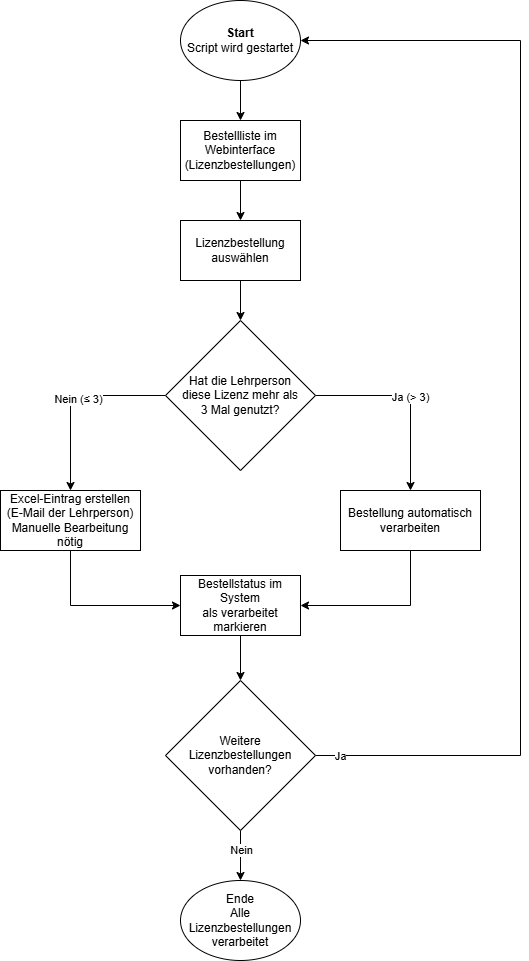

# Automatisierte Verarbeitung von Lizenzbestellungen mit Python und Selenium (Webscraping)

## Schlagwörter
Python, Selenium, Web-Automation, Webscraping, Lizenzbestellungen, Excel (openpyxl), dotenv, Logging, Fehlerbehandlung, Prozessautomatisierung

## Zusammenfassung
Bei Lizenzbestellungen ist nicht jede Bestellung gleich zu behandeln: Lehrpersonen, die eine bestimmte Lizenz bereits mehrfach genutzt haben, können ohne zusätzliche manuelle Überprüfung diese erhalten. Bei weniger erfahrenen Lehrpersonen ist hingegen eine manuelle Kontrolle sinnvoll.

Das Script automatisiert den Entscheidungsprozess. Es durchläuft die Bestellliste, erkennt Lizenzbestellungen und prüft, wie oft die Lehrperson diese Lizenz bereits verwendet hat.  
- **Bei mehr als drei bisherigen Nutzungen** wird die Bestellung automatisch verarbeitet.  
- **Bei drei oder weniger Nutzungen** wird die Bestellung für eine manuelle Bearbeitung notiert und mit der E-Mail-Adresse der Lehrperson in einer Excel-Liste dokumentiert.

Dadurch werden Routinefälle automatisch verarbeitet, während Sonderfälle gezielt und kontrolliert manuell bearbeitet werden können. 
Der Hauptsinn und Nutzen des Programms liegt in der Zeitersparnis bei gleichbleibender Qualität.

## Aufgabenstellung
Der bisherige Ablauf war zeitaufwendig und fehleranfällig, Lizenzbestellungen mussten täglich manuell bearbeitet werden (Öffnen der Bestellung, Navigation zu Detailansichten der LP, Ablesen von Informationen, Dokumentation in einer Liste, Status-Update).
Dabei wurden Routinefälle (erfahrene Lehrpersonen) und Fälle mit erhöhtem Prüfbedarf (wenig Erfahrung) gleich behandelt. Das führte zu unnötigem Aufwand bei Standardfällen und erschwerte die Qualitätskontrolle bei Sonderfällen.
Ziel war es, diesen Prozess zu automatisieren, und den Ablauf so robust zu gestalten, dass er auch bei typischen Web-UI-Problemen (Ladezeiten oder dynamische Elemente) zuverlässig funktioniert.

## Ziele
1. Die Bearbeitungszeit soll im Vergleich zur manuellen Verarbeitung deutlich reduziert werden (Zeitersparnis).
2. Lizenzbestellungen von Lehrpersonen mit mehr als drei bisherigen Nutzungen sollen automatisch verarbeitet werden, ohne manuelle Prüfung.
3. Lizenzbestellungen von Lehrpersonen mit drei oder weniger bisherigen Nutzungen sollen zuverlässig erkannt und für eine manuelle Bearbeitung in einer Excel-Liste erfasst werden.
4. Die Entscheidungslogik (automatisch vs. manuell) soll reproduzierbar und nachvollziehbar sein.
5. Der automatisierte Prozess soll stabil funktionieren, auch wenn die Weboberfläche Ladezeiten oder dynamische Elemente aufweist.

## Beschreibung des Produkts
Das Produkt ist ein Python-Script, das einen Webbrowser automatisiert steuert und Lizenzbestellungen selbstständig verarbeitet.

### Anwendersicht
Aus Anwendersicht wird das Script gestartet und verarbeitet anschliessend alle neuen Lizenzbestellungen automatisch. Nur jene Bestellungen, bei denen eine Lehrperson wenig Erfahrung mit der Lizenz hat, erscheinen anschliessend in einer Excel-Liste zur manuellen Bearbeitung.

### Technische Sicht
Technisch basiert das Produkt auf Python und Selenium. Das Script:
- ruft die Bestellliste im Webinterface auf.
- identifiziert Lizenzbestellungen.
- navigiert zu den Detailansichten.
- zählt frühere Nutzungen der jeweiligen Lizenz.
- entscheidet anhand einer festen Regel (≤ 3 oder > 3).
- schreibt bei Bedarf einen Eintrag in eine Excel-Datei.
- markiert die Bestellung anschliessend im System als verarbeitet.

Das Script ist in einzelne Funktionen gegliedert und verwendet Wartebedingungen sowie Fallback-Mechanismen, um mit dynamischen Webelementen umzugehen.

### Diagramm

Ablaufdiagramm der Verarbeitung von Lizenzbestellungen mit Entscheidungslogik zur Unterscheidung zwischen automatischer und manueller Bearbeitung.

### Einbettung in die Umgebung
Das Script wird im bestehenden administrativen Umfeld eingesetzt. Die manuelle Kontrolle bleibt dort erhalten, wo sie sinnvoll ist.

### Verwendete Technologien
- Python 3.x
- Selenium WebDriver (Firefox/Geckodriver)
- openpyxl (Excel-Erstellung)
- dotenv (Umgebungsvariablen)

### Datenschutz
Der Portfolioeintrag enthält keine Betriebsgeheimnisse und keine vertraulichen Daten:
- Domains, Pfade, IDs und Selektoren anonymisiert
- Screenshots/Screencast sind zensiert
- Nur kurze Code-Snippets gezeigt

## Demonstration des Produkts
Die Anwendung des Produkts wird mit einem zensierten Screencast demonstriert.

Der Screencast zeigt:
1. Die Bestellliste mit neuen Lizenzbestellungen
2. Die automatische Prüfung der bisherigen Lizenznutzung
3. Den Entscheid zwischen automatischer Verarbeitung und Excel-Eintrag
4. Die Aktualisierung des Bestellstatus

Automatisierter Durchlauf des Scripts (zensiert):  
[Video ansehen – screencastedited.mp4](assets/screencastedited.mp4)

Manueller Ablauf einer Lizenzbestellung (zensiert):  
[Video ansehen – manualorderedited.mp4](assets/manualorderedited.mp4)

Der Zeitvergleich zwischen dem manuellen Ablauf und dem automatisierten Durchlauf ist anhand der beiden Screencasts nachvollziehbar. Der automatisierte Ablauf verarbeitet mehrere Bestellungen in deutlich kürzerer Zeit als der manuelle Prozess.

### Technical Highlights
- **Sichere Credentials:** Login über `.env`, keine Passwörter im Code
- **Stabilität:** `WebDriverWait` und zusätzliche Checks statt unzuverlässigem “blind klicken”
- **Fallback-Strategien:** Dropdown-Auswahl/Frames/Navigation haben Ersatzwege

## Ausgewählte Code-Snippets
Folgende Snippets zeigen zentrale Stellen des Codes (Domain/Pfade/Selektoren anonymisiert):

### 1. Login mit Umgebungsvariablen (.env)
Der Login erfolgt über Umgebungsvariablen, damit keine Zugangsdaten im Code sind.

→ [01_login_env.py](snippets/01_login_env.py)

---

### 2. Laden und Filtern neuer Lizenzbestellungen
Dieses Snippet zeigt, wie die Bestellliste geladen und nur neue bzw. unverarbeitete Lizenzbestellungen berücksichtigt werden.

→ [02_get_orders_filter.py](snippets/02_get_orders_filter.py)

---

### 3. Ermittlung der bisherigen Lizenznutzung
Hier wird gezählt, wie oft eine Lehrperson eine bestimmte Lizenz bereits genutzt hat.

→ [03_count_license_usage.py](snippets/03_count_license_usage.py)

---

### 4. Entscheidungslogik: automatisch oder manuell
Kernlogik des Projekts.

→ [04_decision_logic.py](snippets/04_decision_logic.py)

---

### 5. Status-Update mit Fallback-Mechanismen
Zum Abschluss wird der Bestellstatus im Webinterface gesetzt. Es gibt mehrere Fallbacks.

→ [05_status_update.py](snippets/05_status_update.py)

## Reflexion
### Ablauf des Projekts
Zu Beginn habe ich den manuellen Prozess analysiert und in einzelne Schritte geteilt. Danach habe ich einen ersten Prototypen des Scripts erstellt, der nur die Navigation und das Öffnen der Bestellungen machte.

In weiteren Versionen wurde die Entscheidungslogik ergänzt und der Prozess gegliedert. Dabei traten vorallem Probleme mit Ladezeiten, dynamischen Elementen und Dropdowns auf. Diese Probleme wurden durch Wartebedingungen, zusätzliche Prüfungen und Fallbacks gelöst. Am Anfang versuchte ich bestimmte Felder mit zu ungenauen Selektoren zu finden, dies führte zu Unregelmässigkeiten wenn das Script lief.

### Was ich ausprobiert habe
- Verschiedene Strategien für stabile Navigation (Wartebedingungen, “readyState”, gezielte Elementprüfungen)
- Fallbacks für UI-Elemente (Dropdown-Auswahl via Selenium-Select, Klick, JavaScript)
- Schutz sensibler Daten (Credentials aus `.env`, Screenshots/Screencast zensiert)
- Excel-Output für einfach zu lesende Resultate

### Schwierigkeiten und wie ich sie gelöst habe
- **Timeouts/Ladezeiten:** konsequenter Einsatz von `WebDriverWait` statt nur `sleep`
- **Dynamische Tabellen/Elemente:** frühzeitiges Auslesen von Werten, defensive Fehlerbehandlung (z.B. “stale element”)
- **Dropdown nicht interagierbar:** mehrstufiger Fallback (Select → Option klicken → JS)
- **Navigation zurück zur Detailansicht:** “Back” als erster Versuch, ansonsten neu öffnen über eindeutige ID

### Was gut lief
- Deutliche Zeitersparnis im Vergleich zum manuellen Prozess
- Einheitliche Dokumentation über Excel
- Stabiler Ablauf durch Fallbacks

### Was ich beim nächsten Mal anders machen würde
- Selektoren noch robuster gestalten (weniger absolute XPaths, mehr stabile Attribute)
- Strukturierteres Logging (Python `logging`) und optional Zusammenfassungsreport pro Lauf
- Testbare Komponenten stärker von Selenium entkoppeln (z.B. Datenlogik separat)

<h2>Verifizierung der Ziele</h2>

<table>
  <thead>
    <tr>
      <th>Ziel</th>
      <th>Beleg</th>
    </tr>
  </thead>
  <tbody>
    <tr>
      <td>Zeitersparnis</td>
      <td>Vergleich manueller Bearbeitung vs. automatisierter Durchlauf (Screencast)</td>
    </tr>
    <tr>
      <td>Automatische Verarbeitung erfahrener LP</td>
      <td>Screencast + Statusänderung sichtbar</td>
    </tr>
    <tr>
      <td>Excel-Eintrag bei unerfahrenen LP</td>
      <td>Excel-Datei im Screencast sichtbar</td>
    </tr>
    <tr>
      <td>Entscheidungslogik</td>
      <td>Anonymisiertes Code-Snippet</td>
    </tr>
    <tr>
      <td>Stabilität</td>
      <td>Erfolgreicher Durchlauf im Screencast</td>
    </tr>
  </tbody>
</table>
